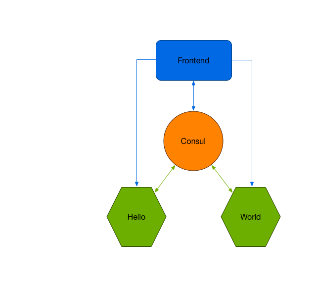

# Hello World on Autopilot

1. git clone git@github.com:autopilotpattern/hello-world.git
2. cd hello-world
3. docker-compose up -d
4. open http://localhost

## Overview

The application is divided into 4 parts:
1. Frontend - nginx server rendering static assets
2. Consul - service catalog used to keep track of registered services
3. Hello - Node.js service responding with the word "Hello"
4. Hello - Node.js service responding with the word "World"

