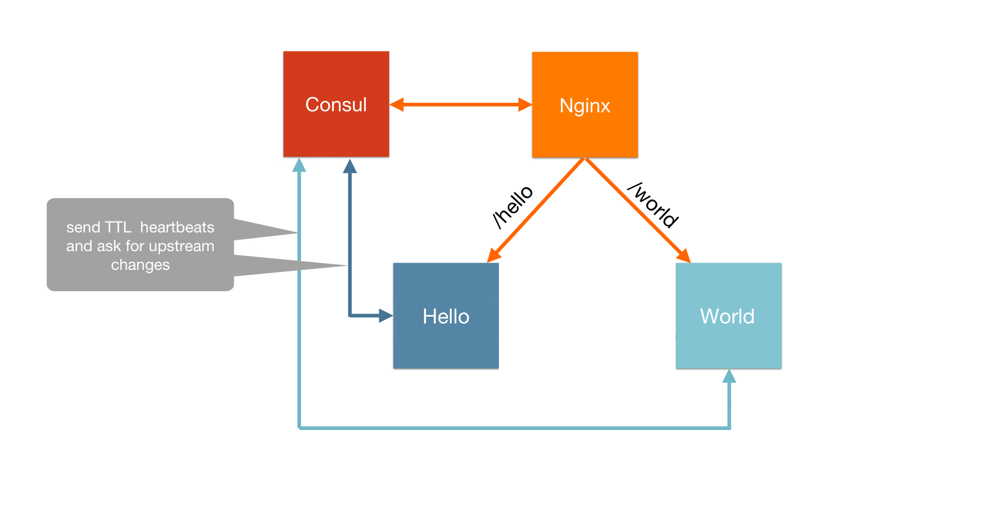
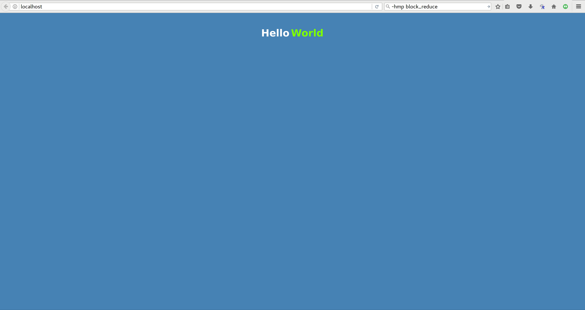
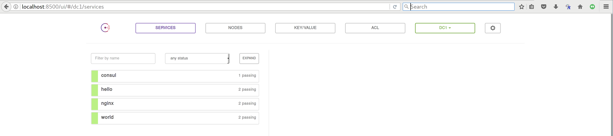

# Hello World using the Autopilot Pattern

1. `git clone git@github.com:autopilotpattern/hello-world.git`
2. `cd hello-world`
3. `docker-compose up -d`
4. `open http://localhost`

## Overview

The application is divided into 4 parts:

1. nginx - nginx server rendering static assets
2. consul - service catalog used to keep track of registered services
3. hello - Node.js service responding with the word "Hello"
4. world - Node.js service responding with the word "World"

# Hello World running on Triton

1. `./triton-docker-setup.sh -k us-east-1.api.joyent.com <ACCOUNT> ~/.ssh/<PRIVATE_KEY_FILE>`
2. `docker-compose up -d`

`docker-compose` spins up 4 containers. 3 of them are built out of repository. They are nginx, hello, and world. All of three are managed by [ContainerPilot](https://www.joyent.com/containerpilot) for application orchestration, health checks and easy service discovery.
They are registered in [Consul](https://www.consul.io/)

